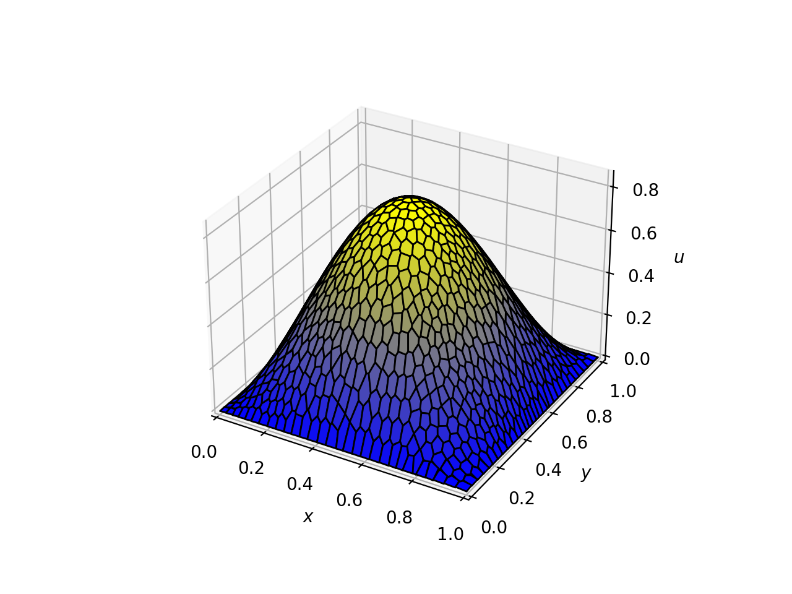

# Summary

Modelling partial differential equations (PDEs) is critical to engineering, physics, and other applied sciences, 
underpinning simulations of a wide range of physical and biological processes. Many high-performance numerical schemes 
are implemented in compiled languages, which offer speed but generally at the cost of accessibility. These 
codebases are often nontrivial to adapt or extend reliably, which hinders rapid experimentation, the development of 
new numerical methods, and effective teaching for both researchers and students.

Reyna is a Python package for solving PDEs using the polygonal discontinuous Galerkin finite element method (DGFEM). It 
allows a flexible and adaptable workflow while remaining approachable, avoiding the complexity, and often prohibitive 
learning curve, of compiled HPC-focused implementations.

Reyna’s modular design and optimised NumPy operations combine speed with clarity, making code both powerful and easy to
read. It provides a platform for developing and testing new finite element methods, and creating concise instructional 
examples, lowering the barrier to experimentation while retaining state-of-the-art numerical capabilities.

# Statement of Need

DGFEMs offer flexibility and high-order accuracy. Using general polygonal elements allows more adaptable meshing, 
supports complex refinement strategies, and can reduce both constraints on element shapes and computational complexity. 
Existing implementations are often written in C++ or Fortran and heavily rely on low-level optimisations to achieve such
high performance. This complexity can hinder rapid experimentation, adaptivity, and educational use, creating 
barriers for researchers and students who want to prototype or explore polygonal DGFEMs without any technical 
overhead.

Reyna addresses these challenges by providing a lightweight, vectorised Python framework that simplifies handling 
polygonal elements and assembling global PDE operators. By leveraging high-level abstractions and standard, well-known 
scientific Python libraries, Reyna achieves efficient computation without requiring specialised HPC infrastructure or 
complex low-level coding. Additionally, its modular architecture enables users to experiment and research without 
bounds.

This combination of accessibility and performance makes Reyna a practical platform for both research and teaching. 
Users can quickly apply new methods, explore the current polygonal DGFEM scheme, and produce working examples
for instruction.

# Description

Reyna is a lightweight Python library that provides a concise and accessible framework for modern polygonal DGFEM. Its
design gives researchers and educators a tool that makes sophisticated techniques easy to prototype, test, and 
share. By emphasising transparency and minimal overhead, the package allows users to explore new ideas rapidly while 
maintaining the rigour required for scientific computation.

The architecture of Reyna is intentionally modular, reflecting the natural workflow of discontinuous Galerkin methods. 
Its structure consists of three components: meshing, geometry, and solving. The meshing layer provides a lightweight 
interface for defining polygonal meshes, whether generated procedurally or defined through custom methods, ensuring 
flexibility in handling general domains (see `Talischi:2012` for the methodology and `@Calloo:2025` for an early example 
of the work). The geometry layer builds on this mesh, computing the necessary information for discretisation, including 
separating boundary and interior edges and calculating their normal vectors (see `Dong:2020` for the implementation 
approach). Finally, the solver assembles (and solves) the global system (see `Cangiani:2014` and `Cangiani:2016` for the 
complete mathematical description of the scheme). This separation leads to code that is both easier to read and more 
adaptable: researchers can, for instance, swap in alternative meshing algorithms or geometry formulations without 
reworking the entire pipeline.

Reyna provides state-of-the-art, highly vectorised assembly routines for constructing the global stiffness matrix and 
forcing vector. These procedures adapt automatically to the generality of each polygonal element without introducing 
considerable computational costs. By relying on NumPy array operations, Reyna achieves strong performance while 
remaining compact, easy to inspect, and faithful to the mathematical formulation.

For solving PDEs, Reyna exposes a clean interface that integrates with SciPy’s sparse linear algebra capabilities. Users 
can assemble and solve second-order, non-negative characteristic PDEs, or extend the same framework to time-dependent 
problems using their preferred timestepping algorithms. Additionally, Reyna includes simple visualisation tools based on 
Matplotlib. Users can plot meshes or render computed solutions directly in a notebook or script, as illustrated in 
\autoref{fig:dg_solution}. These utilities lower the barrier to entry for experimentation and make the package a 
valuable teaching resource.

The overall design philosophy is clarity first: a focused codebase with minimal dependencies (NumPy, SciPy, Shapely, 
Numba, and Matplotlib) written so that users can readily inspect, modify, and extend the implementation. The combination 
of polygonal flexibility, accuracy, and Python accessibility makes Reyna a useful platform both for researchers 
experimenting with new applications and for educators demonstrating advanced numerical methods.



# Example: 50 lines of DGFEM

A notable strength of Reyna is its ability to implement DGFEMs in a highly compact, readable Python style. As a 
demonstration, we present a 'DGFEM in 50 lines of code' example, inspired by work in `@Alberty:1999` and `@Sutton:2017`. 
Despite its brevity, the implementation captures the full computational workflow of a DGFEM simulation.

Consider the exact solution $u(x, y) = \sin(\pi x)\sin(\pi y)$ over the unit square $(0, 1)^2$. Diffusion, advection, 
reaction coefficients, and the forcing term are defined to match this solution, allowing the example to run fully as 
shown below.

```python
import numpy as np

from reyna.polymesher.two_dimensional.domains import RectangleDomain
from reyna.polymesher.two_dimensional.main import poly_mesher

from reyna.geometry.two_dimensional.DGFEM import DGFEMGeometry
from reyna.DGFEM.two_dimensional.main import DGFEM


# Defining the Domain

dom = RectangleDomain(np.array([[0.0, 1.0], [0.0, 1.0]]))

# Defining the Coefficients

def diffusion(x):
    out = np.zeros((x.shape[0], 2, 2), dtype=np.float64)
    for i in range(x.shape[0]):
        out[i, 0, 0] = 1.0
        out[i, 1, 1] = 1.0
    return out


advection = lambda x: np.ones(x.shape, dtype=float)
reaction = lambda x: np.pi ** 2 * np.ones(x.shape[0], dtype=float)
forcing = lambda x: np.pi * (np.cos(np.pi * x[:, 0]) * np.sin(np.pi * x[:, 1]) +
                             np.sin(np.pi * x[:, 0]) * np.cos(np.pi * x[:, 1])) + \
                    3.0 * np.pi ** 2 * np.sin(np.pi * x[:, 0]) * np.sin(np.pi * x[:, 1])

bcs = lambda x: np.sin(np.pi * x[:, 0]) * np.sin(np.pi * x[:, 1])

# Generating the Geometry

poly_mesh = poly_mesher(dom, max_iterations=10, n_points=1024, cleaned=True)
geometry = DGFEMGeometry(poly_mesh)

# Solving the PDE

dg = DGFEM(geometry, polynomial_degree=1)
dg.add_data(
    diffusion=diffusion,
    advection=advection,
    reaction=reaction,
    dirichlet_bcs=bcs,
    forcing=forcing
)

dg.dgfem(solve=True)

```

This minimal implementation is fully functional, demonstrating the package's flexibility. Plotting the resulting 
solution with ```dg.plot_DG()``` produced \autoref{fig:dg_solution}.

The brevity of this 50-line example illustrates two main benefits of Reyna:

- Concise and expressive syntax: The vectorised, lightweight design allows the code to mirror the mathematical 
  formulation closely. This direct correspondence reduces complexity and makes it straightforward to explore new 
  numerical schemes.
- Ideal for research and teaching: The self-contained example is well-suited for classroom demonstrations or 
  tutorials. Users can follow the computational steps clearly and test variations without dealing with low-level setup.

Together, these aspects make Reyna a practical and approachable tool for both researchers exploring new methods and 
educators introducing advanced numerical techniques.

# Acknowledgements

ME would like to acknowledge the support of Ansar Calloo, François Madiot, Tristan Pryer and Luca Zanetti throughout
this work for their insights into both the mathematics behind discontinuous Galerkin methods, as well as scientific
and research programming.

ME is supported by scholarships from the Statistical Applied Mathematics at Bath (SAMBa) EPSRC Centre for Doctoral 
Training (CDT) at the University of Bath under the project EP/S022945/1. ME is also partially funded by the French 
Alternative Energies and Atomic Energy Commission (CEA). All of this support is gratefully acknowledged.

# References
