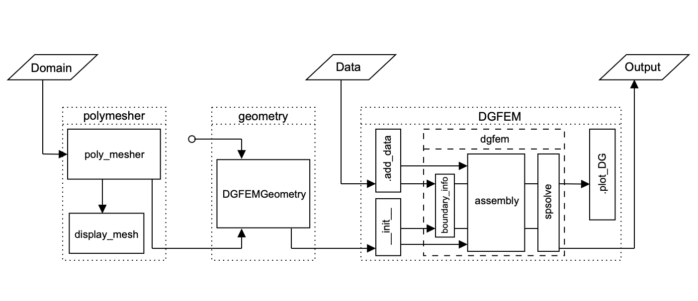
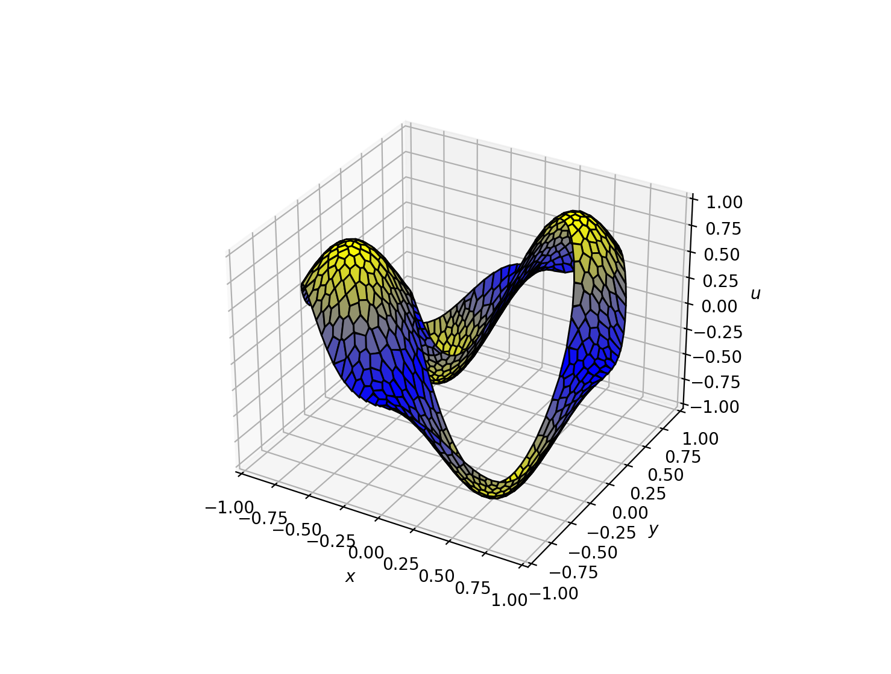

# Summary

Partial differential equations (PDEs) underpin much of engineering,
physics and applied science, providing the basis for simulations
across a wide range of physical and biological systems. Many high-performance numerical schemes are implemented in compiled
languages, which deliver speed but at the cost of accessibility. These
implementations are often difficult to adapt or extend, limiting rapid
experimentation, the development of new methods and their use in
training.

Reyna is a Python package for solving second-order PDEs with
non-negative characteristic form using the polygonal discontinuous
Galerkin finite element method (DGFEM). It offers a flexible and
approachable workflow while avoiding the complexity and steep learning curve of HPC-focused codebases.

Reyna is designed with a modular structure and an optimised
implementation aiming at balancing clarity with performance. It
provides a practical platform for developing and testing finite
element methods and for producing concise instructional examples,
lowering the barrier to experimentation whilst retaining
state-of-the-art numerical capability.

# Statement of Need

DGFEMs offer flexibility and high-order accuracy, and polygonal
elements further extend this adaptability through general meshing and
refined discretisations. Yet most available implementations are
embedded in complex C++ or Fortran frameworks, which require
substantial technical overhead to adapt or extend. This limits their
use for prototyping and teaching.

Reyna provides a lightweight, vectorised Python framework that makes
polygonal DGFEMs accessible without sacrificing efficiency. It enables
rapid experimentation, straightforward extension and practical use in
both research and education by leveraging established scientific
Python libraries and its modular architecture.

# Description

Reyna is a lightweight Python library that provides a concise and
accessible framework for polygonal discontinuous Galerkin finite
element methods (DGFEM). It gives researchers and educators a tool
that makes advanced techniques easy to prototype, test and share. The
package supports rapid exploration of new ideas while retaining the
rigour needed for scientific computation with a particular emphasis on
clarity and minimal ramp-up time.

The architecture of Reyna (\autoref{fig:architecture}) is
intentionally modular, reflecting the natural workflow of finite
element methods. It consists of three modules: polymesher, geometry,
and DGFEM. The polymesher module provides an interface for defining
polygonal meshes, whether generated internally or supplied by custom
methods, enabling flexible handling of general domains (see @Talischi:2012 for methodology and @Calloo:2025 for an early application in neutronics). The geometry module builds on this mesh to
compute the quantities required for discretisation (see @Dong:2020),
while the DGFEM module assembles and solves the global system (see
@Cangiani:2014 and @Cangiani:2016 for mathematical details). This
separation of concerns makes the code easier to extend; for example, different meshing algorithms or geometry formulations can be swapped in without altering the rest of the pipeline.



Reyna provides vectorised assembly routines for constructing the
global stiffness matrix and forcing vector. These routines adapt
automatically to the geometry of each polygonal element without
significant computational overhead. Reyna combines efficiency with
transparency, producing compact code that closely follows the
underlying mathematics through accessible NumPy array
operations. Simple visualisation tools based on Matplotlib are also
included, allowing meshes and solutions to be rendered directly in
scripts or notebooks (\autoref{fig:dg_solution}). For further
examples, Reyna ships with Jupyter notebooks as an interactive
learning resource.



The design philosophy is clarity first, a focused codebase with
minimal dependencies (NumPy, SciPy, Shapely, Numba and Matplotlib)
written so that users can readily inspect, modify and extend the
implementation. The combination of polygonal DGFEMs with Python
accessibility makes Reyna a practical platform for researchers
developing new applications and for educators introducing advanced
numerical methods.

# Example: 50 lines of DGFEM

A key strength of Reyna is the ability to run DGFEM simulations in a
compact and readable Python style. As an illustration, we provide a
“DGFEM in 50 lines of code” example, inspired by @Alberty:1999 and
@Sutton:2017. Despite its brevity, the implementation captures the
complete computational workflow of the package.

We consider the exact solution $u(x,y) = \sin(\pi x)\sin(\pi y)$ on
the ```CircleCircleDomain``` eccentric annular domain. The code below
solves this problem with diffusion, advection and reaction
coefficients, together with a forcing term chosen appropriately for
the exact solution.

```python
import numpy as np

from reyna.polymesher.two_dimensional.domains import CircleCircleDomain
from reyna.polymesher.two_dimensional.main import poly_mesher

from reyna.geometry.two_dimensional.DGFEM import DGFEMGeometry
from reyna.DGFEM.two_dimensional.main import DGFEM


# Defining the Domain

dom = CircleCircleDomain()

# Defining the Coefficients

def diffusion(x):
    out = np.zeros((x.shape[0], 2, 2), dtype=np.float64)
    for i in range(x.shape[0]):
        out[i, 0, 0] = 1.0
        out[i, 1, 1] = 1.0
    return out


advection = lambda x: np.ones(x.shape, dtype=float)
reaction = lambda x: np.pi ** 2 * np.ones(x.shape[0], dtype=float)
forcing = lambda x: np.pi * (np.cos(np.pi * x[:, 0]) * np.sin(np.pi * x[:, 1]) +
                             np.sin(np.pi * x[:, 0]) * np.cos(np.pi * x[:, 1])) + \
                    3.0 * np.pi ** 2 * np.sin(np.pi * x[:, 0]) * np.sin(np.pi * x[:, 1])

bcs = lambda x: np.sin(np.pi * x[:, 0]) * np.sin(np.pi * x[:, 1])

# Generating the Mesh and Geometry

poly_mesh = poly_mesher(dom, max_iterations=10, n_points=1024, cleaned=True)
geometry = DGFEMGeometry(poly_mesh)

# Solving the PDE

dg = DGFEM(geometry, polynomial_degree=1)
dg.add_data(
    diffusion=diffusion,
    advection=advection,
    reaction=reaction,
    dirichlet_bcs=bcs,
    forcing=forcing
)

dg.dgfem(solve=True)

```

This minimal example is fully functional and illustrates the flexibility and 
simplicity of the package. Plotting the solution with ```dg.plot_DG()``` 
produces \autoref{fig:dg_solution}.

The brevity of this example highlights two advantages of Reyna. First,
the vectorised design produces concise code that mirrors the
underlying mathematics, reducing complexity and making it
straightforward to experiment with new numerical schemes. Second, the
example is entirely self-contained, which makes it well-suited to
research demonstrations and teaching. The full workflow is visible,
easy to follow and simple to adapt without low-level setup. While the
example is kept deliberately short, the implementation remains
faithful to the full mathematical formulation, and users can explore
these details directly in the code. These qualities make Reyna a
practical and approachable tool for both researchers developing new
methods and educators introducing advanced numerical techniques.

# Acknowledgements

The authors would like to acknowledge the support of Ansar Calloo,
François Madiot and Luca Zanetti throughout this work. ME is supported
by scholarships from the Statistical Applied Mathematics at Bath
(SAMBa) EPSRC Centre for Doctoral Training (CDT) at the University of
Bath under the project EP/S022945/1 and is also partially funded by
the French Alternative Energies and Atomic Energy Commission (CEA). TP
is supported by the EPSRC programme grant Mathematics of Radiation
Transport (MaThRad) EP/W026899/2 and the Leverhulme Trust
RPG-2021-238. All of this support is gratefully acknowledged.

# References
